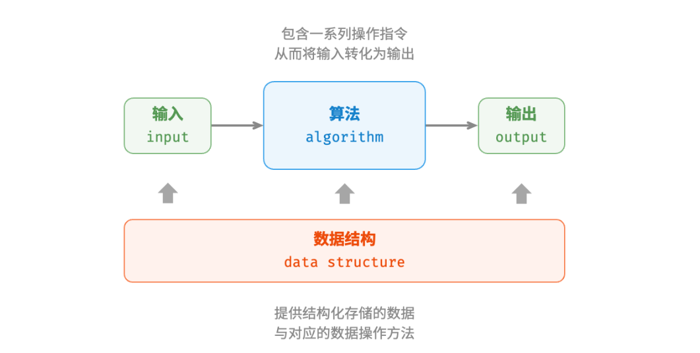

# §1.数据结构与算法前言

## 什么是数据结构？

数据结构（data structure）是组织和存储数据的方式，涵盖数据内容、数据之间关系和数据操作方法，它具有以下设计目标。

- 空间占用尽量少，以节省计算机内存。
- 数据操作尽可能快速，涵盖数据访问、添加、删除、更新等。
- 提供简洁的数据表示和逻辑信息，以便算法高效运行。

## 什么是算法？

算法（algorithm）是在有限时间内解决特定问题的一组指令或操作步骤，它具有以下特性。

- 问题是明确的，包含清晰的输入和输出定义。
- 具有可行性，能够在有限步骤、时间和内存空间下完成。
- 各步骤都有确定的含义，在相同的输入和运行条件下，输出始终相同。

## 数据结构与算法的关系

数据结构与算法高度相关、紧密结合，具体表现在以下三个方面。

- 数据结构是算法的基石。数据结构为算法提供了结构化存储的数据，以及操作数据的方法。
- 算法是数据结构发挥作用的舞台。数据结构本身仅存储数据信息，结合算法才能解决特定问题。
- 算法通常可以基于不同的数据结构实现，但执行效率可能相差很大，选择合适的数据结构是关键。

数据结构与算法是独立于编程语言的

## 如何学好数据结构与算法？

1. 死磕代码
2. 画图思考

## 相关书籍

- 《大话数据结构》：思想非常不错，代码有些欠缺
- 《剑指offer》
- 《程序员代码面试指南》
- 《程序员面试金典》
- 《编程之美》
- 《编程珠玑》
- 《数据结构与算法：xxx语言描述》
- 《算法》
- 《算法导论》
- 《计算机程序设计艺术》